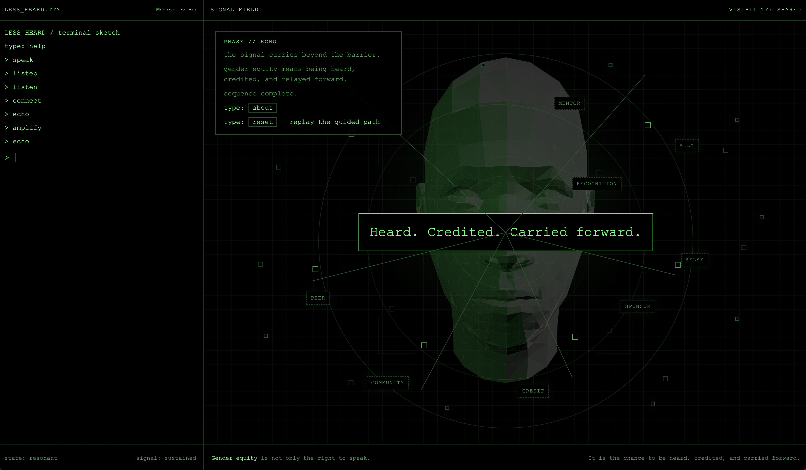

# Less Heard

Interactive frontend piece about gender equity in tech — built for the [WeCoded Challenge 2026](https://dev.to/challenges/wecoded-2026) on DEV.to.

🔗 **Live demo:** https://fcwebdesign.github.io/Less-Heard/



## Concept

A terminal-based interactive experience. Type `help` to start, then follow the guided path: `speak → listen → connect → amplify → echo`.

The piece explores how voices from women and gender minorities in tech are often present before they are equally heard — and what it takes to change that.

## Files

- `index.html` — markup
- `style.css` — styles
- `main.js` — interaction & Three.js face rendering
- `model.glb` — 3D face model

## Stack

Vanilla HTML/CSS/JS + [Three.js](https://threejs.org/). No build step, no dependencies to install.

## Run locally

Any static server works:

```bash
npx serve .
# or
python3 -m http.server
```

Then open `http://localhost:3000` (or whichever port).
